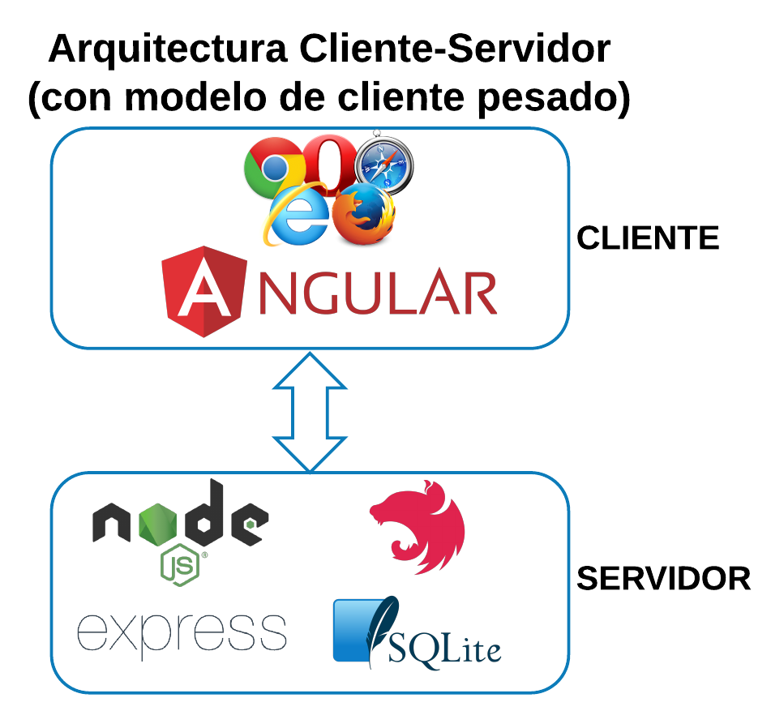
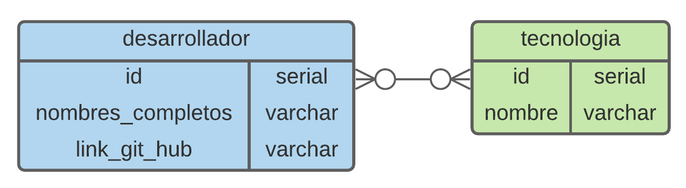

# Desarrolladores App

## Descripción
Aplicación web que permite el registro de datos de desarrolladores de software y
las tecnologias que conocen. 

## Arquitectura


### Backend
- Node.js
- Lenguaje TypeScript
- Framework NestJS v7 integrado con Express
- Base de datos SQLite v3

### Frontend
- Lenguajes TypeScript, HTML y CSS
- Framework Angular v10
- Componentes de PrimeNG


## Modelo Entidad Relación


## Instalación
### Backend
```bash
$ npm i -g @nestjs/cli

$ cd back-end
$ npm install
```

### Frontend
```bash
$ npm install -g @angular/cli

$ cd front-end
$ npm install
```

## Ejecución
### Backend
```bash
$ cd back-end

# i) development
$ npm run start

# ii) watch mode
$ npm run start:dev

# iii) production mode
$ npm run start:prod
```

### Frontend
```bash
$ cd front-end

# i) development watch mode
$ ng serve 
# and navigate to http://localhost:4200/

# ii) production mode
$ npm run build
```


## Pruebas
### Backend
```bash
$ cd back-end

# unit tests
$ npm run test

# e2e tests
$ npm run test:e2e

# test coverage
$ npm run test:cov
```

### Frontend
```bash
$ cd front-end

# unit tests
$ ng test

# e2e tests
$ ng e2e
```

## Despliegue con Docker
```bash
# build
$ docker build -t dev-app .

# deploy
$ docker run -it -p  30000:3000 --name dev-app-container dev-app
```


## Contacto
- Twitter - [@wradguz](https://twitter.com/wradguz)
- LinkedIn - [darwin-guzman](https://www.linkedin.com/in/darwin-guzman/)

## License
MIT licensed
